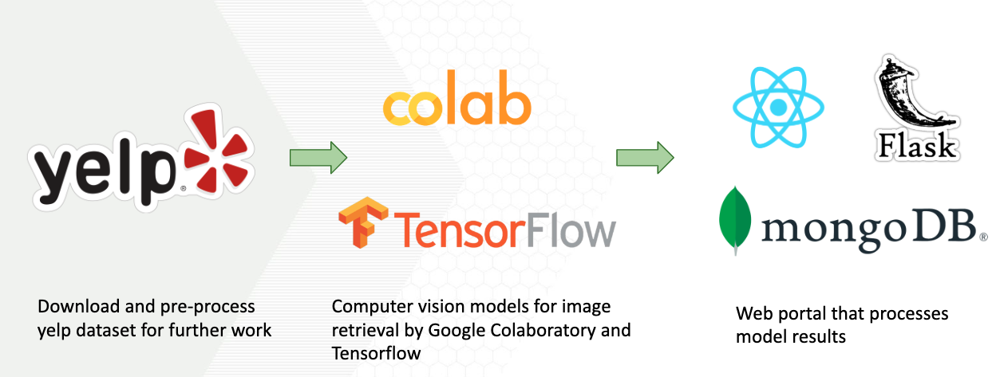
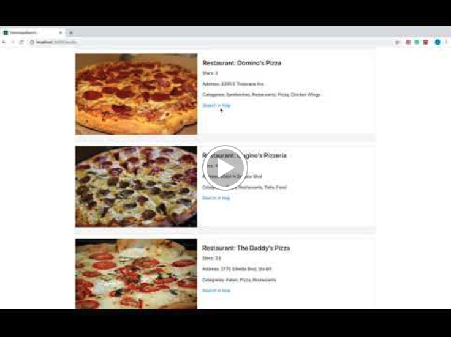

# YelpImageSearch
> This is the final project for CS6220 Big Data System and Analytics in Gatech. We aim to help people search the restaurants based on the photos.

## Introduction

In our daily life, sometimes we see some good foods in Facebook or Instagram but we don't know their names. Also, Yelp and Google Map don't support restaturants search based on food images. 

Therefore, we developed this Yelp Restaurant Iamge Search application. Users can upload a food image and find the restaurants with the searched food in Yelp. To implement it, we explore the traditional image retrieval methods like SIFT, deep learning methods like CNN model and the combinations of these two methods.

## Architecture
- The data preprocess and analysis are developed by MongoDB and Python.
- The front end is developed by React.
- The backend is developed by Flask.
- The SIFT and CNN model are developed by Python and TensorFlow on Google Colab.



## Data Preperation

### Remote Database

A remote MongoDB is hosted so that you don't need to do the data loading yourself. However, due to the storage limit of free cluster, only a small amount of photos are loaded to the remote database. This may result in the failure of loading some images on the result page.

To switch to use remote database, edit ```frontend/server.js``` line 21, change ```LOCAL_URL``` to ```ATLAS_URI``` to connect to the remote database.

### Local Database

- Download dataset from [Yelp Open Dataset](https://www.yelp.com/dataset). Extract the downloaded files and put folders **"yelp_dataset"** and **"yelp_photos"** under the **"data/"** folder.

- Install [MongoDB](https://docs.mongodb.com/manual/installation/)

- Create a database named **yelp** in MongoDB.

- Import **"yelp_dataset/business.json"** as the **business** collection in **yelp** database.

```
mongoimport --db yelp --collection business --type JSON --file data/yelp_dataset/business.json
```

- Import **"yelp_dataset/photo.json"** as the **photo** collection in **yelp** database. 

```
mongoimport --db yelp --collection photo --type JSON --file data/yelp_dataset/photo.json
```

- To create the file **LVImageBase64.json** containing the photo_id of photos for businesses in Las Vegas city and the corresponding photos encoded as base 64, under **"scripts/"** directory, run the command

```
python3 createPhotoImageJson.py
```

- To create the folder **LV_photos** containing all the food imagesin Las Vegas city, under **"scripts/"** directory, run the command

```
./lv_food.sh
```

- Import **"data/yelp_dataset/LVImageBase64.json"** as the ```image``` collection in ```yelp``` database.  
 
```
mongoimport --db yelp --collection image --type JSON --jsonArray --file data/yelp_dataset/LVImageBase64.json
```

To switch to use local database, edit ```frontend/server.js``` line 21, change ```ATLAS_URI``` to ```LOCAL_URL``` to connect to the local database.


## Installation and Development


### Prerequisite:

- npm
- python3
- colab

### Installation

#### Image Retrieval Models 

- For the SIFT image retrieval model part, you can open the ipynb files ```model/sift_retrieval.ipynb``` in Google Colab. After running it, you can get three files **4000vocab.h5**, **feats.h5** and **paths.h5**. Then put them into **"output/"**

- For the CNN image retrieval model part, you can open the ipynb files ```model/image_search_cnn.ipynb``` in Google Colab. After running it, you can get two files **LasVegasFoodFeatures** and **best_model.hdf5**. Then put them into **"output/"**.

Since it takes a lot of time to run these two files, we provide the files in our [Google Drive](https://drive.google.com/drive/folders/12TH7Yz1bxPhcun7ebZ7vWRFNW_r9iggG?usp=sharing).

#### Evaluation

In the **"evaluation/"** directory, use conda to create the environment based on **"environment_mac.yml"**. 

To evaluate the performance of one method, you can run the command:

```
python3 evaluate.py [method] [img_path]
```

For the method, we support **sift**, **cnn**, **rerank** and **average**.

#### Web Application

- To install the dependencies and run the frontend, under the **"frontend/"** directory, run the command 

```
npm install
nodemon server
nodemon
```

- To install the dependencies and run the backend, under the **"backend/"** directory, run the command 

```
pip3 install requirements.txt
python3 app.py
```


## Usage example

The demo of our application is shown in the following video:

[](https://www.youtube.com/watch?v=P-gYRTt4tmk)

## Meta
### Development: 
- Bin Xie - bin.xie@gatech.edu
- Anjian Peng - penganjian@gatech.edu
- Minyi Hu - mhu80@gatech.edu
- Xibei Zhang - xb_zhang@gatech.edu
